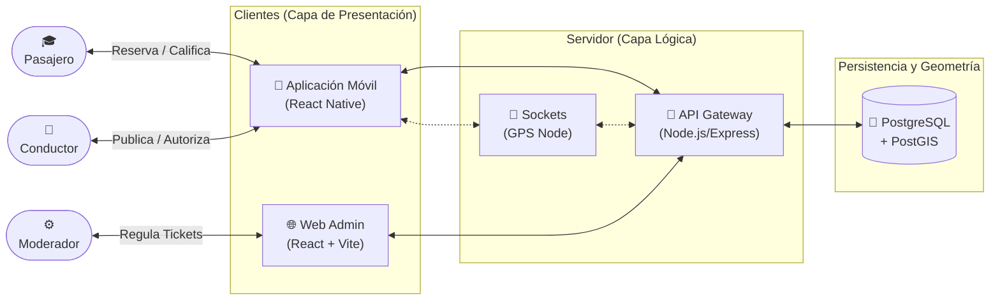

<div align="center">
  
  <h1>🚗 U-Ride: Plataforma Institucional de Carpooling</h1>
  <p>
    <b>Movilidad estudiantil de extremo a extremo: Segura, verificada, organizada.</b>
  </p>

  [](#)
  [](#)
  [](#)
</div>

<br />

## 📑 Tabla de Contenidos

- [Acerca del Proyecto](#-acerca-del-proyecto)
- [Arquitectura del Sistema](#-arquitectura-del-sistema)
- [Características y Flujo (Features)](#-características-y-flujo)
- [Pila Tecnológica Integrada](#-pila-tecnológica-integrada)
- [Requisitos Previos y Configuración](#-requisitos-previos-e-instalación)
- [Estrategia de Quality Assurance (STLC)](#-estrategia-de-quality-assurance-stlc)
- [Directrices de Contribución](#-directrices-de-contribución)
- [Licencia e Integrantes](#-licencia)

---

## 📖 Acerca del Proyecto

En entornos de baja afluencia u horarios nocturnos, los estudiantes enfrentan inseguridad y dificultad para la movilización urbana. **U-Ride** es un ecosistema tecnológico diseñado exclusivamente para comunidades universitarias cerradas que permite coordinar rutas de transporte seguro.

Su naturaleza impide el registro de usuarios ajenos a la institución educativa, asegura una trazabilidad transparente usando geolocalización basada en zonas protegidas y obliga a un esquema meritocrático para el uso continuo de la plataforma a través de un algoritmo de reputación cívica.

---

## 🏛️ Arquitectura del Sistema

El ecosistema entero está desplegado sobre un entorno interconectado por APIs seguras y WebSockets:



---

## ✨ Características y Flujo

El sistema U-Ride rige su lógica alrededor de exigencias de negocio de alta criticidad:

* **Muro de Identidad Institucional:** Algoritmo que interceptará todo registro, bloqueándolo si no porta extensión de dominio universitario (`.edu`).
* **Protección Espacial (PostGIS):** Se erradica la latitud/longitud pública en domicilios. El conductor/pasajero filtran a través de Polígonos de Barrio con la base geoespacial.
* **Control Absoluto Transaccional:** La subida de un Pasajero es controlada. Una vez aceptado el Match por el Piloto, las reservas disminuyen los asientos automáticamente (ACID rules).
* **Calificaciones de Impacto Sensible:** Reputación calculada al concluir el ciclo. Evidencias y penalidades resueltas a través de portal cerrado del SuperAdmin.
* **Extras Escalables:** Componente modular preparado analíticamente para un Wallet de simulación de pagos e intersección de Sockets (Live Geofencing).

---

## 🖥️ Pila Tecnológica Integrada

- **Aplicación Móvil:** React Native / Expo (Trazabilidad nativa para flujos operativos).
- **Tablero Backoffice:** React.JS / Vite / TailwindCSS (Para interfaz veloz de control).
- **Core de Infraestructura:** Node.js / Express.
- **Sistema de Manejador de Bases (ORDBMS):** PostgreSQL (Equipado con PostGIS) + Prisma ORM o pg-client puro.

---

## 🚀 Requisitos Previos e Instalación

### 1. Variables de Entorno (`.env`)
En el directorio raíz del back-end, clonar el fichero de ejemplo (`.env.example` si existiese) o crear el respectivo `.env`.
```bash
PORT=5000
DB_HOST=127.0.0.1
DB_PORT=5432
DB_USER=root
DB_PASSWORD=secret
DB_NAME=uride
JWT_SECRET=tu-llave-segura
```

### 2. Arranque del Entorno (Desarrollo)
El proyecto es un Monorepo estructurado por directorios. Exige levantar tres consolas para operación íntegra:

```bash
# Consola 1: Backend
$ cd backend 
$ npm install 
$ npm run dev

# Consola 2: Portal del Administrador Web
$ cd frontend 
$ npm install 
$ npm run dev

# Consola 3: Entorno Cliente Pasajero/Conductor
$ cd mobile 
$ npm install 
$ npx expo start
```

---

## 🧪 Estrategia de Quality Assurance (STLC)

Para cumplir explícitamente con los entregables de *Gestión de Pruebas e Implantación de Software*, U-Ride se acoplará paralelamente a métricas QA:

1. **Unit Testing:** Implementado con `Jest` a nivel de micro-funciones (Ej: Algoritmo que calcula penalizaciones reputacionales).
2. **Integration Testing:** Apoyado por `Supertest` para ejecutar Requests asíncronos HTTP evaluando las barreras del JWT y los Endpoints del servidor.
3. **E2E / Automatización UX:** Cobertura de flujos mediante `Selenium` para emular escenarios de uso crítico en el marco web (Moderación y resolución).
4. **Pruebas No Funcionales (Carga):** Testeo perimetral bajo estrés en horas pico universitarias usando `JMeter`.
5. **Calidad de Código / Seguridad Estática:** Ejecución de sondeos continuos usando `SonarQube` (Deuda algorítmica) y test anti-inyecciones `OWASP-ZAP` para robustez de credenciales.

---

## 🤝 Directrices de Contribución

1. Este repositorio se basa en Tareas registradas en el archivo `TAREAS_URIDE.md`.
2. Asigna un `Task-ID` a tu rama de forma estructurada: `git checkout -b feature/BK-1-autenticacion`.
3. Todo código desarrollado **debe** presentar un levantamiento de requerimiento documentado en formato markdown dentro de la suite `/documentacion`. Sin este reporte estudiantil, la tarea no se acepta en RAMA `main`.

---

## 📄 Licencia

Este proyecto está bajo el desarrollo académico privado requerido para la asignatura. 
**Prohibida su refactorización ajena o propósitos transaccionales externos comunitarios sin autorización interna del departamento.**
